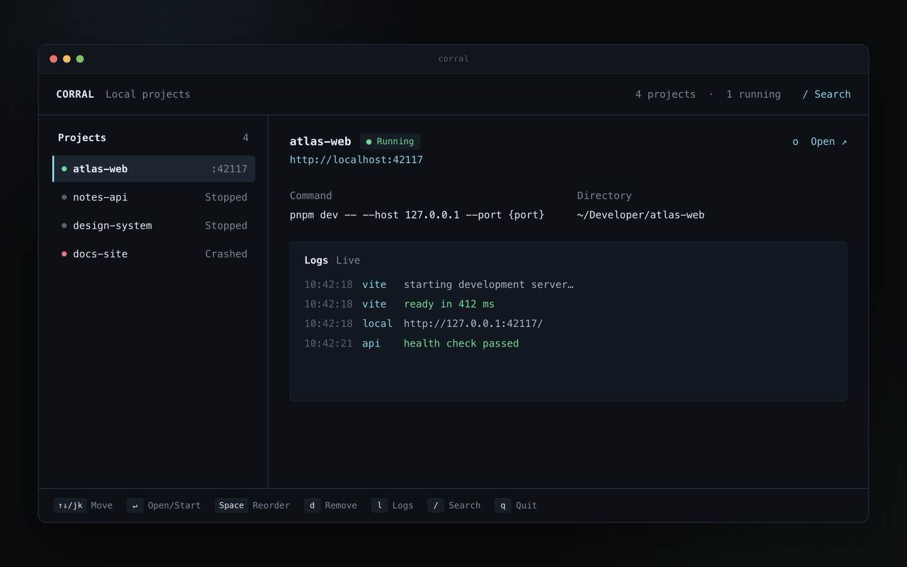
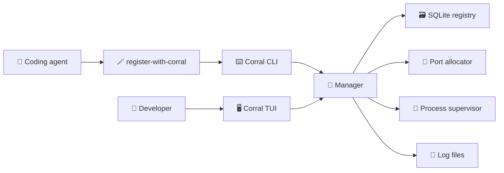

<div align="center">

# Corral

### Round up every local project. Launch anything in one keystroke.

[](https://go.dev/)
[](https://github.com/charmbracelet/bubbletea)


**English** · [简体中文](README.zh-CN.md)

</div>

---

Corral is a global TUI launcher for local development projects. Your coding agent keeps the project catalog current; you open Corral from anywhere and press **Enter** to start the app you need.

No more remembering directories. No more hunting through `package.json`. No more localhost port collisions. ✨

## 🌟 Why Corral?

When several projects are in motion, their startup knowledge becomes scattered across shell history, README files, package scripts, and your own memory. Corral turns that knowledge into a small, reliable catalog.

- 🧠 **Forget the command** — store the verified startup command once.
- 🗺️ **Launch from anywhere** — every project runs in its registered working directory.
- 🚦 **Avoid port collisions** — reuse the last port when possible or allocate a free one.
- 🪄 **Agent-maintained** — the portable Agent Skill registers projects after verifying them.
- 🧵 **Control the whole process tree** — start, stop, and restart detached development servers.
- 📜 **Keep logs close** — inspect recent output without leaving the TUI.
- ↕️ **Arrange your workspace** — move projects up or down and keep that order across launches.
- 🧹 **Clean up safely** — remove registrations in the TUI with an explicit confirmation step.
- 📦 **Ship one binary** — Go builds for macOS, Linux, and Windows.

## 🖥️ The TUI



*The image uses fictional project names, paths, ports, and logs.*

The compact workbench adapts to narrow and wide terminals. A restrained selection rail replaces the old block highlight; running, starting, unhealthy, stopped, and crashed projects remain distinguishable by both symbol and color. The detail pane keeps the command, URL, path, and latest output in view.

## ✨ Install with one prompt

Copy the prompt below into your local coding agent. It tells the agent to download Corral, install the CLI and the bundled Skill, configure your PATH, and verify the complete setup.

```text
Install Corral from https://github.com/huggon1/corral and complete the setup end to end.

1. Detect my operating system, CPU architecture, shell, and the tools already available. Use platform-appropriate commands and keep all installation paths user-owned when possible.
2. Ensure Go 1.25 or newer is available. If it is missing or too old, install or upgrade it with the established package manager for this machine. Ask before any step that requires administrator privileges.
3. Clone the Corral repository into a stable user-owned source directory, or safely update an existing clean checkout. Preserve unrelated files and local changes. Do not create commits or push anything.
4. Build and install `github.com/huggon1/corral/cmd/corral`. Put the `corral` executable on my persistent PATH without overwriting unrelated shell configuration.
5. Install the repository's `skills/register-with-corral` directory into the user-level Skill directory supported by this coding agent. Inspect the agent's local conventions or documentation instead of assuming a product-specific path. Copy the complete Skill directory and validate its `SKILL.md`. If this agent has no Skill mechanism, keep the repository-local Skill available and clearly report that limitation.
6. Open a fresh shell or reload its environment as needed. Verify that `command -v corral` (or the platform equivalent) resolves the installed binary, `corral --help` succeeds, and the installed Skill matches the repository copy.
7. Finish only after reporting the exact repository, binary, and Skill paths, plus any action I still need to take. Tell me that the only daily command I need to remember is: `corral`.

Do not register or start any projects during installation unless I explicitly ask you to.
```

After that one-time setup, the only command you need to remember is:

```bash
corral
```

Your coding agent will use the installed Skill to verify and register runnable projects as it works on them. Corral opens the shared catalog from any directory.

<details>
<summary><strong>🛠️ Manual installation</strong></summary>

Corral requires Go 1.25 or newer:

```bash
go install github.com/huggon1/corral/cmd/corral@latest
corral
```

To build from source:

```bash
git clone https://github.com/huggon1/corral.git
cd corral
make build
./dist/corral
```

Copy `skills/register-with-corral` into the user-level Skill directory documented by your coding agent.

</details>

## ➕ Register a project

Corral accepts any command that starts a project with a known HTTP(S) URL. The command may use fixed ports, several internal services, or an optional `{port}` placeholder.

For a command that starts a web app on `4317` and an API health endpoint on `4318`:

```bash
corral register \
  --path /absolute/path/to/atlas-web \
  --name atlas-web \
  --url 'http://127.0.0.1:4317' \
  --ready-url 'http://127.0.0.1:4318/health' \
  -- npm run dev
```

`--url` is what Corral opens for the user. `--ready-url` is the endpoint Corral waits for; it defaults to `--url`. Registration is idempotent, so registering the same canonical path updates the existing project.

Fixed-port projects are fully supported, but two processes still cannot bind the same fixed host port. Corral reports that launch failure instead of rejecting the project at registration time.

When a project accepts an external port, `{port}` keeps collision avoidance automatic. It can appear in command arguments or environment values:

### More examples

```bash
# Vite / Next.js
corral register --path . --name web -- npm run dev -- --port '{port}'

# Port through the environment
corral register --path . --name web --env 'PORT={port}' -- npm run dev

# FastAPI
corral register --path . --name api -- uvicorn main:app --port '{port}'

# Python static server
corral register --path . --name docs -- python3 -m http.server '{port}'
```

Pass ordinary, non-secret environment settings with repeated `--env KEY=VALUE` flags. Keep credentials in the project's existing secret mechanism.

## ⌨️ Keyboard shortcuts

| Key | Action |
|:---:|---|
| `↑` / `k` | Select previous project |
| `↓` / `j` | Select next project |
| `Space` | Pick up the selected project; while picked up, `↑` / `k` and `↓` / `j` move it and persist the order |
| `Space` / `Enter` / `Esc` | Put the project down and exit reorder mode |
| `Enter` | Start a stopped project or open a running project |
| `o` | Open the selected project's URL |
| `x` | Stop the selected project |
| `r` | Restart the selected project |
| `l` | Toggle expanded logs |
| `d` | Remove a project after confirmation; running projects are stopped first |
| `/` | Search projects |
| `q` | Quit Corral without stopping projects |

## 🧰 CLI

The same core powers the TUI and non-interactive commands, so humans and agents always see the same state.

| Command | Purpose |
|---|---|
| `corral` | Open the TUI |
| `corral register …` | Create or update a project |
| `corral list [--json]` | List every project |
| `corral start <project>` | Start and wait until the readiness URL responds |
| `corral stop <project>` | Stop the complete process group |
| `corral restart <project>` | Restart a project |
| `corral status <project>` | Print machine-readable state |
| `corral logs [-n lines] <project>` | Print recent logs |
| `corral remove <project>` | Stop and remove a project |

A project can be addressed by its display name or stable ID. If a name is ambiguous, Corral asks for the ID instead of guessing.

## 🤖 Agent-native registration

The one-prompt setup installs the repository-local [`register-with-corral`](skills/register-with-corral/SKILL.md) Skill. It teaches compatible coding agents to register the command they actually verified—not one inferred from filenames.

```text
skills/register-with-corral/SKILL.md
```

Agents that support Agent Skills or repository-local skills can use this file directly. The installation prompt asks each agent to discover and use its own supported Skill location instead of assuming a product-specific directory.

The Skill guides the agent to:

1. 🔍 Find the intended development command and primary URL.
2. 🧪 Run the command as-is, using `{port}` only when the project supports it.
3. ✅ Verify the primary URL or a separate HTTP health endpoint.
4. 🧹 Stop the validation process.
5. 📝 Register the verified command, URL, and readiness URL.

The Skill only maintains registration. Corral remains the single source of truth for ports, processes, state, and logs.

## 🧭 How it works



The TUI and CLI cross one small manager interface. Platform-specific behavior stays in dedicated Unix and Windows process adapters, keeping the rest of the code portable and testable.

## 💾 Data and safety

Corral stores its registry and logs in the operating system's user configuration directory:

- macOS: `~/Library/Application Support/corral/`
- Linux: `${XDG_CONFIG_HOME:-~/.config}/corral/`
- Windows: `%AppData%\corral\`

Set `CORRAL_HOME` to use an isolated location.

Commands are stored and executed as argument arrays, not interpolated shell strings. On Unix, projects run in independent sessions; on Windows, Corral controls the spawned process tree with the platform process tools. Quitting the TUI leaves running projects alive.

## 🛠️ Development

```bash
make test          # unit, integration, process lifecycle, and layout tests
make build         # current platform
make cross-build   # macOS, Linux, and Windows release binaries
```

The integration suite starts a real temporary HTTP server, verifies its assigned port, stops its process group, and confirms the final state. TUI tests also guard 80×24 and 120×36 layouts against overflow.

## 🗺️ Direction

- 📚 Project groups and favorites
- ❤️ TCP and log-based readiness probes
- 🔌 Multiple named dynamic ports
- 🔎 Runtime URL discovery from logs
- 💤 Start on request and idle shutdown
- 🍺 Homebrew and additional package managers
- 🪟 Stronger native Windows process supervision

---

<div align="center">

Built for developers—and agents—who always have one more local project running. ✨

</div>
