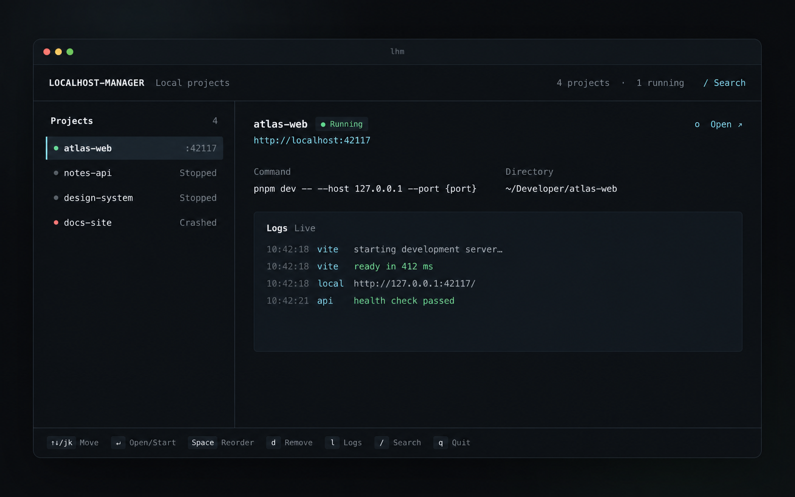
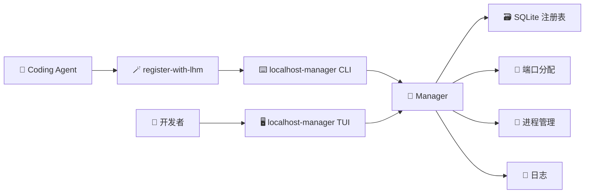

<div align="center">

# localhost-manager

### 收拢所有本地项目，一次按键即可启动。

[](https://go.dev/)
[](https://github.com/charmbracelet/bubbletea)


[English](README.md) · **简体中文**

</div>

---

localhost-manager 是一个全局本地开发项目启动器。Coding Agent 自动维护项目清单；你可以在任意目录打开 localhost-manager，按下 **Enter** 启动需要的项目。

不用记项目目录，不用翻找启动脚本，也不用再处理 localhost 端口冲突。✨

## 🌟 为什么使用 localhost-manager？

- 🧠 **不用记命令**：只保存实际验证成功的启动方式。
- 🗺️ **任意目录启动**：项目始终在注册的工作目录中运行。
- 🚦 **自动避免冲突**：优先复用上次端口，不可用时自动分配空闲端口。
- 🪄 **Agent 自动维护**：通用 Agent Skill 在验证项目后执行幂等注册。
- 🧵 **管理完整进程树**：可靠地启动、停止和重启开发服务器。
- 📜 **日志随手可见**：直接在 TUI 中查看最近输出。
- ↕️ **自由安排顺序**：将项目上移或下移，并在下次打开时保留顺序。
- 🧹 **安全清理项目**：在 TUI 内确认后删除登记；运行中的项目会先停止。
- 📦 **单二进制分发**：支持 macOS、Linux 和 Windows。

## 🖥️ TUI



*图中的项目名、路径、端口和日志均为虚构数据。*

紧凑工作台会根据终端宽度自动切换布局。选中项目使用细色条和低对比底色，不再使用大块高亮；running、starting、unhealthy、stopped 和 crashed 同时通过符号与颜色区分。

## ✨ 复制一次，安装完成

把下面整段提示词复制给你本地的 Coding Agent。Agent 会自动下载 localhost-manager、安装 CLI 与 Skill、配置 PATH，并完成验证。

```text
请从 https://github.com/huggon1/localhost-manager 安装 localhost-manager，并端到端完成全部配置。

1. 检测我的操作系统、CPU 架构、Shell 和已有工具，使用适合当前平台的命令；可行时优先使用用户自有的安装目录。
2. 确保 Go 1.25 或更高版本可用。如果未安装或版本过低，使用本机已有的标准包管理器安装或升级；需要管理员权限时先询问我。
3. 将 localhost-manager 仓库克隆到稳定的用户目录，或安全更新已有的干净 checkout。保留无关文件和本地修改，不要创建 commit，不要 push。
4. 构建并安装 `github.com/huggon1/localhost-manager/cmd/lhm`。把 `lhm` 可执行文件加入持久生效的 PATH，不要覆盖无关的 Shell 配置。
5. 把仓库中的 `skills/register-with-lhm` 安装到当前 Coding Agent 支持的用户级 Skill 目录。检查 Agent 的本地规约或文档，不要假设某个特定产品的路径。复制完整 Skill 目录并验证 `SKILL.md`。如果该 Agent 不支持 Skill，保留仓库本地 Skill，并明确报告这个限制。
6. 按需新建 Shell 或重新加载环境。验证 `command -v lhm`（或当前平台的等价命令）能找到二进制、`lhm --help` 执行成功，且已安装 Skill 与仓库版本一致。
7. 只有在报告仓库、二进制和 Skill 的准确路径，以及仍需我处理的事项后，才算完成。告诉我，日常唯一需要记住的命令是：`lhm`。

安装期间不要登记或启动任何项目，除非我已经明确要求。
```

完成这次一次性配置后，你只需要记住：

```bash
lhm
```

之后 Coding Agent 会通过已安装的 Skill，在处理可运行项目时自动验证并登记。localhost-manager 可以在任意目录打开这份共享清单。

<details>
<summary><strong>🛠️ 手动安装</strong></summary>

localhost-manager 需要 Go 1.25 或更高版本：

```bash
go install github.com/huggon1/localhost-manager/cmd/lhm@latest
lhm
```

从源码构建：

```bash
git clone https://github.com/huggon1/localhost-manager.git
cd localhost-manager
make build
./dist/lhm
```

将 `skills/register-with-lhm` 复制到你的 Coding Agent 文档指定的用户级 Skill 目录。

</details>

## ➕ 注册项目

只要一条命令能启动项目，并且有一个已知的 HTTP(S) URL，localhost-manager 就可以管理它。命令可以使用固定端口、同时启动多个内部服务，或选择性使用 `{port}`。

例如，一条命令同时启动 `4317` 上的 Web 应用和 `4318` 上的 API 健康检查：

```bash
lhm register \
  --path /absolute/path/to/atlas-web \
  --name atlas-web \
  --url 'http://127.0.0.1:4317' \
  --ready-url 'http://127.0.0.1:4318/health' \
  -- npm run dev
```

`--url` 是 localhost-manager 为用户打开的地址；`--ready-url` 是 localhost-manager 等待就绪的地址，默认与 `--url` 相同。重复注册相同规范路径时，只会更新现有项目。

localhost-manager 可以完整管理固定端口项目，但两个进程仍然无法同时绑定同一个宿主机端口。发生这种情况时，localhost-manager 会在启动时报告冲突，而不会在登记时拒绝项目。

如果项目支持外部指定端口，可以继续使用 `{port}` 自动避免冲突。它可以出现在命令参数或环境变量中：

```bash
# Vite / Next.js
lhm register --path . --name web -- npm run dev -- --port '{port}'

# 通过环境变量传入端口
lhm register --path . --name web --env 'PORT={port}' -- npm run dev

# FastAPI
lhm register --path . --name api -- uvicorn main:app --port '{port}'

# Python 静态服务器
lhm register --path . --name docs -- python3 -m http.server '{port}'
```

普通非敏感环境变量可以通过重复的 `--env KEY=VALUE` 传入。凭据应继续交给项目自身的 secret 机制管理。

## ⌨️ 快捷键

| 按键 | 操作 |
|:---:|---|
| `↑` / `k` | 选择上一个项目 |
| `↓` / `j` | 选择下一个项目 |
| `Space` | 拿起当前项目；拿起后用 `↑` / `k`、`↓` / `j` 移动，并持久保存顺序 |
| `Space` / `Enter` / `Esc` | 放下项目并退出排序模式 |
| `Enter` | 启动已停止项目，或打开运行中项目 |
| `o` | 打开项目 URL |
| `x` | 停止项目 |
| `r` | 重启项目 |
| `l` | 展开或收起日志 |
| `d` | 确认后删除项目；运行中的项目会先停止 |
| `/` | 搜索项目 |
| `q` | 退出 localhost-manager，但不停止项目 |

## 🧰 CLI

```bash
lhm                              # 打开 TUI
lhm list --json                  # Agent 可读的项目清单
lhm start image-tool
lhm status image-tool
lhm logs -n 200 image-tool
lhm stop image-tool
lhm restart image-tool
lhm remove image-tool
```

项目可以通过显示名称或稳定 ID 操作。如果名称存在歧义，localhost-manager 会要求使用 ID，而不会随意选择。

## 🤖 Agent 自动注册

上面的一次性安装提示词会安装仓库中的通用 [`register-with-lhm`](skills/register-with-lhm/SKILL.md) Skill。它兼容支持 Agent Skills 或仓库本地 Skill 的编程 Agent：

```text
skills/register-with-lhm/SKILL.md
```

安装提示词会要求 Agent 自行发现它支持的 Skill 位置，不假设 Codex、Claude Code 或其他特定产品的目录结构。

Skill 会要求 Agent：

1. 🔍 找到预期的开发启动命令和 primary URL。
2. 🧪 按原样执行命令，仅在项目本身支持时使用 `{port}`。
3. ✅ 验证 primary URL 或独立的 HTTP 健康检查地址。
4. 🧹 停止验证进程。
5. 📝 登记已验证的命令、URL 和 readiness URL。

Skill 只维护注册信息；端口、进程状态和日志仍由 localhost-manager 统一管理。

## 🧭 工作方式



CLI 与 TUI 使用同一个核心接口。Unix 和 Windows 的差异集中在各自的进程 Adapter 中，不会扩散到注册表和界面。

## 💾 数据位置

- macOS：`~/Library/Application Support/localhost-manager/`
- Linux：`${XDG_CONFIG_HOME:-~/.config}/localhost-manager/`
- Windows：`%AppData%\localhost-manager\`

设置 `LHM_HOME` 可以使用独立的数据目录。

## 🛠️ 开发

```bash
make test
make build
make cross-build
```

测试覆盖真实 HTTP 子进程的启动和停止、随机端口、状态恢复、SQLite 注册，以及 80×24 和 120×36 的 TUI 布局。

---

<div align="center">

献给那些永远还会再启动一个本地项目的开发者和 Agent。✨

</div>
